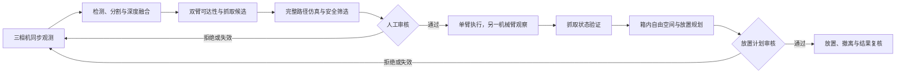

# Dual-Arm Logistics Workflow

面向三相机双臂机器人的确定性物料抓取与入箱工作流。系统将任务拆分为同步观测、目标检测与分割、深度融合、抓取候选生成、全路径仿真、人工审批、单臂执行、另一机械臂辅助观察、抓取验证、入箱规划和结果复核。

仓库默认运行在离线模式。真实硬件执行需要显式开关、完整标定、仿真通过和人工确认；任何场景变化、计划过期、关节状态漂移或碰撞余量不足都会终止流程。

## 工作流



## 目录

- `src/robot_workflow/`：领域模型、安全策略、审批令牌、协议适配、状态机、观察修正与离线仿真。
- `scripts/`：离线演示、观测规划、抓取候选评估、主工作流和中断恢复入口。
- `calibration/`：三相机内外参采集、求解和对齐验证工具。
- `config/`：不会启用硬件的示例配置；设备地址、序列号和真实标定参数需在本地填写。
- `tests/`：状态机、安全边界、协议、三相机观测、夹爪间隙和标定约束测试。
- `docs/`：架构说明与上线门禁。

## 离线运行

要求 Python 3.9 或更高版本。核心离线状态机仅依赖标准库：

```powershell
$env:PYTHONPATH='src'
python scripts/run_offline_demo.py --approve-simulation
```

三相机标定、视频记录、硬件辅助脚本和完整测试集需要 NumPy 与 OpenCV：

```powershell
python -m pip install -e ".[vision]"
python -m unittest discover -s tests -v
```

## 硬件接入

1. 将 `config/camera_identity.example.json` 复制为本地配置并填写三台相机序列号。
2. 完成 head eye-to-hand 与左右腕部 eye-in-hand 标定。
3. 将 `config/live.example.json` 复制到仓库外的部署目录，填写服务地址和标定矩阵。
4. 先运行离线测试和仿真预览，再使用惰性训练道具进行低速验证。
5. 只有在现场急停、操作员审核和执行前状态复核均就绪时，才能启用硬件执行开关。

外部机器人 SDK、模型权重、厂商二进制、设备凭据、现场日志、采集视频和真实设备配置不在本仓库中。

## 设计文档

- [三相机抓取—入箱工作流设计](docs/architecture.md)
- [离线验证与上真机门禁](docs/offline-and-live-checklist.md)
- [三相机标定工具](calibration/README.md)

## 安全说明

默认配置中的 `hardware_execution_enabled` 为 `false`。请勿删除计划摘要校验、一次性审批令牌、场景时效检查、执行前关节复核、碰撞报告检查和结果验证。
