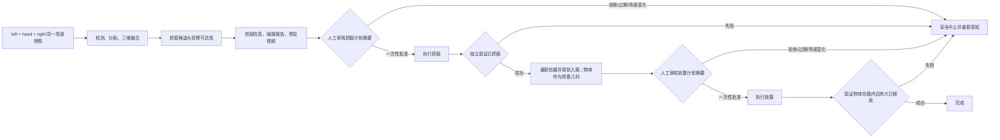

# 三相机抓取—入箱工作流设计

## 结论

工作流把开放词汇模型限制在任务理解、目标定位和候选生成范围内；相机完整性、三维标定、轨迹边界、碰撞检查、计划时效、人工批准和执行前状态复核均由确定性代码控制。核心包不导入厂商机器人 SDK，硬件适配由部署侧显式注入。

## 三路相机的职责

三路 RGB 都参与目标与箱子的语义检测，可减少腕部相机被夹爪或物体遮挡时的漏检。用于生成世界坐标、抓取姿态或碰撞几何时，每一路相机还必须同时提供：同一帧对应的深度、内参、深度单位、时间戳、设备序列号，以及 `world_from_camera`。

- left/right 是 eye-in-hand 相机，其世界位姿需由当前关节状态、机械臂基座外参、末端外参和相机外参联合计算。
- head 是固定 eye-to-hand 相机，需单独标定 `world_from_camera`。现有配置只有 `device_id: 0`，不能安全参与三维融合。
- `device_id` 可能因 USB 枚举顺序变化，真机阶段必须同时锁定相机 serial number；不能只相信 0/1/2。
- 当前 `get_obs()` 依次读取设备，不能假设三帧严格同步。工作流以时间戳检查最大帧间差，超限即重新拍摄。

## 两次不可合并的人工审核

抓取和放置是两个不同的场景、不同的轨迹，必须分别审核。每个审核对象包含 plan ID、scene ID、起始关节、完整 waypoints、碰撞报告、视频 SHA-256、创建/失效时间及整个计划的 SHA-256。批准令牌绑定这些内容且只能消费一次。

人工看过视频后到实际发送命令前，系统再次读取关节并确认场景仍为原 scene ID。任何漂移、过期或内容变化都会使批准失效；不能复用上一次批准，也不能把“LLM 调用了工具”当成人工批准。

## 入箱而非“移动到箱子中心”

放置目标应建模为箱子内部的自由体积，而不是一个三维点：

1. 用三相机分割箱体/箱口，估计箱口平面、内壁和可用内部体积。
2. 根据待放物体尺寸和抓取姿态，对内壁、箱沿和已有物体做安全膨胀。
3. 选择从上方可达且具有最大余量的放置位姿；空间不足时直接拒绝。
4. 将抓住的物体加入机械臂的 attached collision geometry。
5. 规划“箱口上方等待 → 垂直插入 → 低速释放 → 垂直退出”，同时检查另一机械臂、桌面、箱体和障碍物。
6. 放置后重新观察，通过目标 mask 在箱内、深度关系以及夹爪状态进行验证。

仿真后端必须返回带时间的轨迹、完整碰撞集合、最小间距和附着物体检查结果。只有 IK 路径或预览视频时，结果只能用于观察，不能单独证明轨迹可安全执行。
